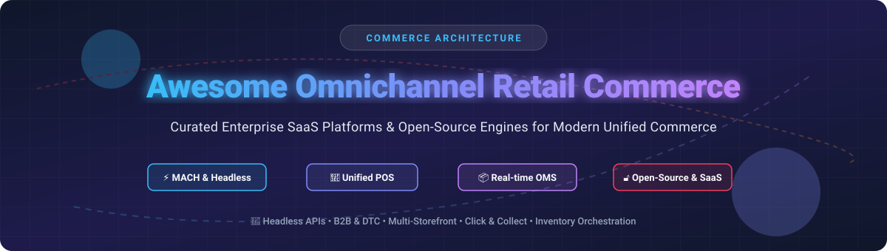

# Awesome-Omnichannel-Retail-Commerce

# Awesome-Omnichannel-Retail-Commerce 🛒 🌐

  

  
  
  
  
  
  

---

## 🌟 Top Omnichannel Retail Commerce Ecosystem

**Curated List of Commercial Omnichannel Commerce Platforms & Open-Source Headless Commerce Engines**  
*Focused on Unified Commerce, Headless Architecture, B2B/B2C, POS Integration & Composable Commerce*  

**Last updated: October 2026** 📅

---

### 📌 Overview & SEO Summary
Welcome to the ultimate curated directory of **omnichannel retail commerce platforms**, **headless commerce frameworks**, and **open-source e-commerce engines**. Whether you are looking for enterprise-grade commercial suites (such as *Microsoft Dynamics 365 Commerce*, *Shopify Plus*, *Salesforce Commerce Cloud*, and *Adobe Commerce*), or high-performance open-source alternatives (like *Medusa*, *Saleor*, *Spree Commerce*, and *Vendure*), this list covers category leaders, composable architectures, and self-hosted omnichannel solutions.

---

## 📑 Table of Contents
- [🏢 SaaS & Commercial Platforms](#-saas--commercial-platforms)
- [🔓 Open-Source GitHub Projects](#-open-source-github-projects)
- [🛠️ How to Contribute](#%EF%B8%8F-how-to-contribute)
- [📊 Star History](#-star-history)
- [🤝 Support & Sponsorship](#-support--sponsorship)
- [⚠️ Disclaimer](#%EF%B8%8F-disclaimer)

---

## 🏢 SaaS / Commercial Platforms

The enterprise omnichannel commerce market is dominated by a handful of platforms with pricing models ranging from GMV-based subscriptions (Salesforce Commerce Cloud at 1% GMV) to GMV-tiered licenses (Adobe Commerce at ~$22,000–$190,000/year) and transaction-based scale units (Microsoft Dynamics 365 Commerce at $16,381.93 per 10,000 transactions/month). SAP Commerce Cloud commands the highest entry point, with first-year TCO for mid-market (~$50M GMV) reaching approximately $790,000 [citation:7].

| SaaS / Commercial Platform | Company / Owner | Valuation / Market Cap | Standard Edition Starting Price | Free Tier / Free Trial Limits | Description |
| :--- | :--- | :--- | :--- | :--- | :--- |
| **[Microsoft Dynamics 365 Commerce](https://dynamics.microsoft.com/en-us/commerce/)** 🏢 | Microsoft | ~$3.90 Trillion | Scale Unit Standard: $16,381.93/10,000 transactions/month [citation:2] | No free tier; Copilot credits for AI usage billed separately | **Unified retail commerce suite** — POS, e-commerce, call center, and AI-driven personalization. Deep ERP integration with Dynamics 365 Finance & Operations. |
| **[Shopify Plus](https://www.shopify.com/plus)** 🛍️ | Shopify Inc. | ~$100 Billion | $2,500/month (1-year term) or $2,300/month (3-year) [citation:16] | 3-day free trial; no permanent free tier | **Enterprise DTC & B2B commerce** — high-volume checkout, multi-store management, Shop Pay, and headless Hydrogen storefronts. |
| **[Salesforce Commerce Cloud](https://www.salesforce.com/products/commerce-cloud/)** ☁️ | Salesforce | ~$250 Billion | 1% Gross Merchandise Value (GMV) [citation:4] | 30-day free trial; no permanent free tier | **AI-powered omnichannel commerce** — B2C, B2B, D2C, and order management. Einstein AI for personalization and recommendations. |
| **[Adobe Commerce (Magento)](https://business.adobe.com/products/magento/magento-commerce.html)** 🎨 | Adobe | ~$200 Billion | ~$22,000/year on-premise; ~$40,000/year cloud (estimated, GMV-tiered) [citation:17] | No free tier; Open Source (Magento CE) available separately | **Enterprise composable commerce** — B2B, B2C, and multi-brand. Cloud infrastructure with Fastly CDN included. |
| **[SAP Commerce Cloud](https://www.sap.com/products/crm/commerce-cloud.html)** 🔷 | SAP SE | ~$200 Billion | $150,000+/year (license only, TCO often $350K+) [citation:7] | No free tier; quote-based | **Enterprise B2B/B2C commerce** — Designed for complex catalogs (100K+ SKUs), ERP-native pricing, and multi-country deployments. |
| **[BigCommerce](https://www.bigcommerce.com/)** 🏪 | BigCommerce Holdings | ~$500 Million | Standard: $29/mo (annual); Plus: $79/mo; Pro: $299/mo [citation:19] | 15-day free trial; no permanent free tier | **Open SaaS commerce** — Headless APIs, B2B features, and multi-storefront. GMV-tiered pricing with Open Payment Provider fees. |
| **[commercetools](https://commercetools.com/)** 🔧 | commercetools | Private | ~$40,000/year (quote-based) [citation:20] | No free tier; trial available on request | **MACH composable commerce** — API-first, cloud-native, and highly scalable. Supports 50,000 prices per SKU for deep B2B segmentation [citation:9]. |
| **[VTEX](https://vtex.com/)** 🌎 | VTEX | ~$1.5 Billion | Custom enterprise pricing (ISV plans from R$999/year) [citation:10] | No free tier; developer sandbox available | **Latin America’s commerce leader** — Omnichannel, marketplace, and B2B capabilities. 2,200+ enterprise customers. |
| **[Oracle CX Commerce](https://www.oracle.com/cx/commerce/)** 🔴 | Oracle | ~$300 Billion | $180,000–$600,000+/year (estimated) [citation:1] | No free tier | **Enterprise e-commerce** — Deep Oracle ecosystem integration (ERP, CRM, Service Cloud). Price groups for multi-currency and account-based pricing [citation:12]. |
| **[Aptos Unified Commerce](https://www.aptos.com/)** 🏬 | Aptos Retail | Private | Custom enterprise pricing | No free tier | **Retail-first unified commerce** — 135,000+ stores, 40+ years in retail tech. Cloud-native POS with offline resilience [citation:14]. |

---

## 🔓 Open-Source GitHub Projects

*Sorted by GitHub_Stars_Count (Descending)* 🌟

- **[Medusa](https://github.com/medusajs/medusa)**   
  **The world’s most flexible commerce platform**, MIT licensed. Modular architecture with 22+ commerce modules (Cart, Order, Payment, Fulfillment, Inventory). Workflows engine for multi-step operations with rollback. TypeScript/Node.js + PostgreSQL. Self-hostable or Medusa Cloud. Tekla reported 70% conversion increase post-migration [citation:22].

- **[Saleor](https://github.com/saleor/saleor)**   
  **Leading open-source MACH commerce platform**, BSD-3-Clause licensed. GraphQL-first API, AI-ready storefront foundation, 45+ dashboard extension mount points. 21.8K+ GitHub stars. Channels for multi-surface commerce (web, mobile, POS). Saleor Cloud with 99.99% SLA available [citation:23][citation:31].

- **[Spree Commerce](https://github.com/spree/spree)**   
  **Open-source omnichannel commerce for DTC, B2B, and marketplaces**, BSD-3-Clause licensed. REST APIs, TypeScript SDKs, Next.js storefront. Seller onboarding with commission engine, B2B price lists, multi-tenant SaaS Enterprise Edition. Zero platform fees [citation:11].

- **[Sylius](https://github.com/Sylius/Sylius)**   
  **Headless e-commerce framework for Symfony**, MIT licensed. Full control over data model, business logic, and checkout flow. Used by Carrefour, Forbes, PwC, and Mytheresa. Sylius Plus adds RBAC, multi-source inventory, and B2B pricing engine [citation:25][citation:33].

- **[Vendure](https://github.com/vendure-ecommerce/vendure)**   
  **TypeScript-first commerce framework for developers**, MIT licensed. NestJS + GraphQL + PostgreSQL/MySQL. Plugin architecture with Strategy pattern for behavior replacement. 40,000+ monthly npm downloads, 7,800+ GitHub stars. Used by IBM and Swile [citation:24][citation:32].

- **[nopCommerce](https://github.com/nopSolutions/nopCommerce)**   
  **The most popular ASP.NET e-commerce platform**, MIT licensed. 250,000+ community members. Version 4.90 adds AI content tools, B2B workflows, and industry-specific modules. Free and open-source since 2008 [citation:28].

- **[Odoo eCommerce](https://github.com/odoo/odoo)**   
  **Open-source business suite with e-commerce**, LGPL-3.0 licensed. AI website builder, drag-and-drop product pages, real-time stock management, click-and-collect, and integrated POS. Free forever with domain name included [citation:26][citation:34].

- **[WooCommerce](https://github.com/woocommerce/woocommerce)**   
  **WordPress-based e-commerce platform**, GPL-3.0 licensed. Powers ~40% of all online stores. POS extensions (WCPOS, OpenPOS) enable omnichannel retail with real-time stock sync and barcode scanning [citation:35][citation:27].

- **[ShopCube](https://github.com/Abdur-rahmaanJ/shopcube)**   
  **E-commerce and POS for Python shops**, MIT licensed. Built on Shopyo Flask framework. Inventory with multi-location, purchase orders, POS with shift management, customer groups, and role-based access [citation:29].

- **[Spwig Commerce](https://github.com/Spwig/commerce)**   
  **Runtime feature-gated commerce platform**, AGPL-3.0 licensed. Community/Pro/Enterprise run same binary with license flags. Provider SDKs (Apache-2.0) enable proprietary payment/shipping integrations without AGPL contamination [citation:36].

---

## 🛠️ How to Contribute

Contributions are welcome! Follow these steps to submit new omnichannel retail platforms or open-source commerce software:

1. 🍴 **Fork** the repository.
2. 📝 **Add/edit** entries in `README.md` maintaining table/list structure and formatting.
3. 🔗 Include project title, official website/GitHub link, exact Stars_Count, license, and brief description.
4. 🚀 Submit a **Pull Request** with a descriptive summary of your changes.

---

## 📊 Star History

---

## 🤝 Support & Sponsorship

If you find this omnichannel retail commerce repository useful, please consider supporting the project:

- ⭐ **Star** this repository to increase visibility!
- 🔀 **Fork** and share with fellow developers & commerce architects.
- ☕ **Sponsor & Buy Me a Coffee**: Support ongoing open-source curation via the [GitHub Sponsor Dashboard](https://github.com/sponsors/ishandutta2007).

---

## ⚠️ Disclaimer

- This is a **community-curated** list — not exhaustive and not an endorsement. ℹ️
- Omnichannel commerce platforms process customer payment data and PII. **Review PCI DSS compliance and data residency** before committing to any platform. 🔒
- Open-source commerce engines (Medusa, Saleor, Spree, Vendure) provide self-hosted ownership and zero platform fees, but enterprise-grade SLAs, managed cloud infrastructure, and vendor support remain primarily commercial offerings. 🛒

---

  <b>Made with ❤️ for commerce architects, retail technologists, and open-source e-commerce developers.</b>

